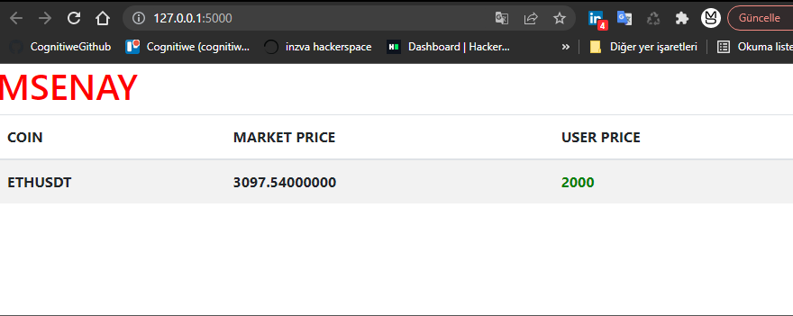
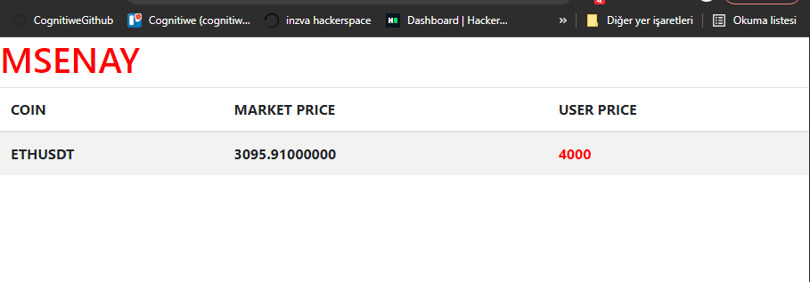

"# assignment-website" 

 
<h3>please enter these commands:</h3>
  <h2>docker-compose build</h2>
  <h2>docker-compose up</h2>
<h3>Market Price was taken with socket from Binance</h3>
<h3>User should post his price to this endpoint : http://localhost:5000/websocket</h3>
<h3>Format have to be {"symbol":"<coinname>","price":"<price>"}</h3>
<h3>If user price higher than market price it turns to red otherwise it is green.</h3>

<h3> A lot of improvements can be made this is just a starter </h3>

<h3> for exemaple our system wait for user post right now so it can be improved </h3>

<h5>Thanks</h5>
